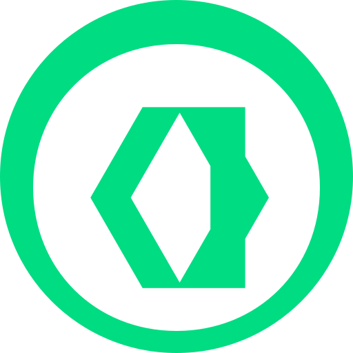

<!-- Header -->
<h2 align="left" style="font-size: 2em; margin-bottom: 0;">
  Olá, eu sou Gabriel Campos
  
</h2>

<!-- Headline + Posicionamento -->

  
  

    <h3 style="margin-top: 0; font-weight: 600;">Desenvolvedor Full-Stack | Java + Spring Boot + Vue.js</h3>
    

      Graduando em <strong>Sistemas de Informação</strong> na UFJF, focado em construir aplicações web escaláveis e performáticas. Experiência hands-on com desenvolvimento backend robusto (Java/Spring) e interfaces modernas e reativas (Vue/Nuxt). Atualmente aprofundando conhecimentos em arquitetura de microsserviços e padrões de design enterprise.
    

  

 

<!-- O que faço / Contexto Atual -->
<table style="min-width:100%; border-collapse:collapse; border:0; margin-top:1.2em;">
  <tbody>
    <tr style="border:none;">
      <td style="width:60px; padding-right:12px; vertical-align:top; border:0; padding-bottom:12px;">
        
      </td>
      <td style="width:100%; vertical-align:top; border:0; padding-bottom:12px;">
        

          <strong>Sistemas de Informação</strong> — Universidade Federal de Juiz de Fora (UFJF)
        

        

          Cursando disciplinas de Engenharia de Software, Banco de Dados e Arquitetura de Sistemas
        

      </td>
    </tr>
    <tr style="border:none;">
      <td style="width:60px; padding-right:12px; vertical-align:top; border:0; padding-bottom:12px;">
        
      </td>
      <td style="width:100%; vertical-align:top; border:0; padding-bottom:12px;">
        

          Buscando oportunidades como <strong>Desenvolvedor Full-Stack Java + Vue.js</strong>
        

        

          Estágio, júnior ou projetos colaborativos em empresas que valorizam código limpo e evolução técnica
        

      </td>
    </tr>
    <tr style="border:none;">
      <td style="width:60px; padding-right:12px; vertical-align:top; border:0; padding-bottom:12px;">
        
      </td>
      <td style="width:100%; vertical-align:top; border:0; padding-bottom:12px;">
        

          Atualmente estudando: <strong>Spring Boot avançado</strong>, <strong>Vue.js 3 Composition API</strong> e <strong>Docker</strong>
        

        

          Implementando 15+ Design Patterns em Java como parte da disciplina DCC078
        

      </td>
    </tr>
    <tr style="border:none;">
      <td style="width:60px; padding-right:12px; vertical-align:top; border:0;">
        
      </td>
      <td style="width:100%; vertical-align:top; border:0;">
        

          📧 <strong>dev.camposgabriel@gmail.com</strong> | 
          💼 <a href="https://www.linkedin.com/in/gabriel-campos-lima-alves-947554249/" target="_blank"><strong>LinkedIn</strong></a>
        

      </td>
    </tr>
  </tbody>
</table>

<!-- Stack Técnica -->

  <h3 style="font-weight:500; margin-bottom:0.3em;">🛠️ Stack Técnica</h3>

  

  
⚙️ Backend & Infraestrutura

  

    
    
    
    
  

  

  

  
🎨 Frontend & Frameworks

  

    
    
    
    
    
    
  

  

  

  
🔧 Ferramentas & Versionamento

  

    
    
  

  

<!-- Projetos Acadêmicos / Estudos -->

  <h3 align="center" style="font-weight:500; margin-bottom:0.5em;">📚 Aprendizado Estruturado</h3>
  
  

  
<strong>🎯 Design Patterns em Java (DCC078 — UFJF)</strong>

  

    Implementação prática de <strong>15 padrões de design GoF</strong> em Java, parte da disciplina de Padrões de Projeto. Cada repositório contém implementação completa com casos de uso reais e documentação detalhada.
  

  <h4 style="margin-top:1em; margin-bottom:0.3em;">Padrões Criacionais</h4>
  <ul style="line-height:1.8;">
    <li><a href="https://github.com/CamposCodes/PadroesCriacionais-Singleton">Singleton</a> — Garantia de instância única</li>
    <li><a href="https://github.com/CamposCodes/PadroesCriacionais-FactoryMethod">Factory Method</a> — Criação de objetos delegada a subclasses</li>
    <li><a href="https://github.com/CamposCodes/PadroesCriacionais-AbstractFactory">Abstract Factory</a> — Famílias de objetos relacionados</li>
    <li><a href="https://github.com/CamposCodes/PadroesCriacionais-Builder">Builder</a> — Construção step-by-step de objetos complexos</li>
    <li><a href="https://github.com/CamposCodes/PadroesCriacionais-Prototype">Prototype</a> — Clonagem de objetos</li>
  </ul>

  <h4 style="margin-top:1em; margin-bottom:0.3em;">Padrões Estruturais</h4>
  <ul style="line-height:1.8;">
    <li><a href="https://github.com/CamposCodes/PadroesEstruturais-Bridge">Bridge</a> — Separação de abstração e implementação</li>
    <li><a href="https://github.com/CamposCodes/PadroesEstruturais-Adapter">Adapter</a> — Compatibilidade entre interfaces</li>
    <li><a href="https://github.com/CamposCodes/PadroesEstruturais-Decorator">Decorator</a> — Adição dinâmica de funcionalidades</li>
    <li><a href="https://github.com/CamposCodes/PadroesEstruturais-Flyweight">Flyweight</a> — Otimização de memória</li>
    <li><a href="https://github.com/CamposCodes/PadroesEstruturais-Composite">Composite</a> — Estruturas hierárquicas</li>
  </ul>

  <h4 style="margin-top:1em; margin-bottom:0.3em;">Padrões Comportamentais</h4>
  <ul style="line-height:1.8;">
    <li><a href="https://github.com/CamposCodes/PadroesComportamentais-Observer">Observer</a> — Notificação de mudanças</li>
    <li><a href="https://github.com/CamposCodes/PadroesComportamentais-Strategy">Strategy</a> — Algoritmos intercambiáveis</li>
    <li><a href="https://github.com/CamposCodes/PadroesComportamentais-State">State</a> — Mudança de comportamento baseada em estado</li>
    <li><a href="https://github.com/CamposCodes/PadroesComportamentais-TemplateMethod">Template Method</a> — Estrutura de algoritmo reutilizável</li>
    <li><a href="https://github.com/CamposCodes/PadroesComportamentais-Iterator">Iterator</a> — Navegação em coleções</li>
    <li><a href="https://github.com/CamposCodes/PadroesComportamentais-Mediator">Mediator</a> — Centralização de comunicação</li>
  </ul>
  

<!-- GitHub Stats -->

  <h3 style="font-weight:500; margin-bottom:0.5em;">📊 Atividade no GitHub</h3>
  

<!-- Contato / CTA Final -->

  <h3 style="font-weight:500; margin-bottom:0.5em;">🤝 Vamos conversar?</h3>
  

    Estou aberto a oportunidades de estágio/júnior, projetos open source e networking com outros devs. 
    Se você busca um desenvolvedor full-stack comprometido com qualidade e evolução técnica, entre em contato!
  

  

    
    
    
  

---

  ⭐ Se você achou meus projetos interessantes, considere dar uma estrela nos repositórios!

