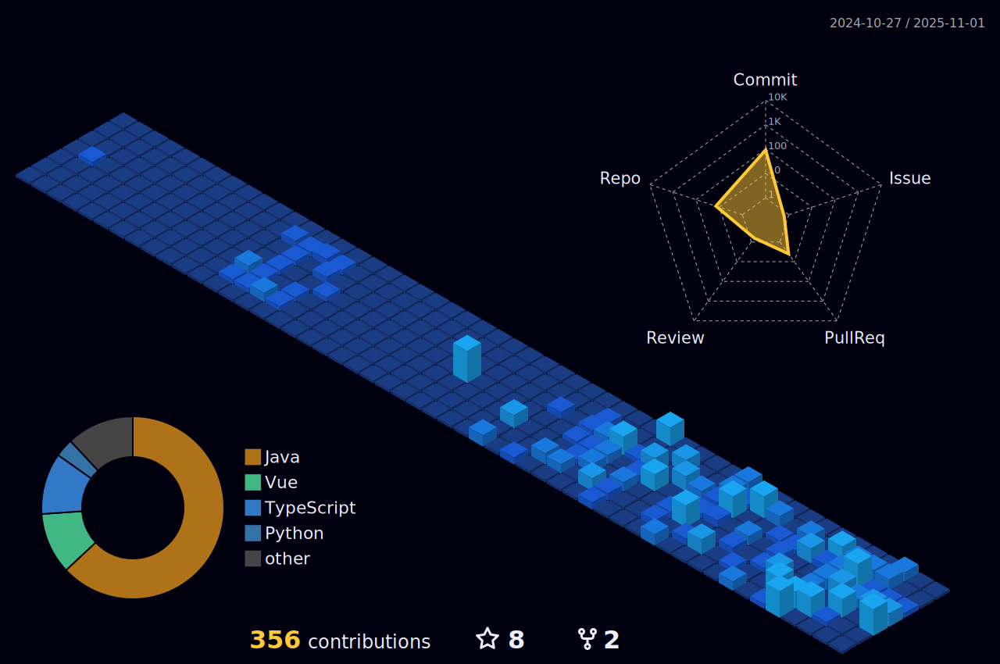

<!-- Header / Apresentação -->
<h2 align="left" style="font-size: 2em; margin-bottom: 0;">
  Olá, você aí...
  
   
  
Eu sou <i>Gabriel Campos Lima Alves</i>

  
(I’m Gabriel Campos Lima Alves)

</h2>

<!-- About / Perfil -->

  
  

    <strong>PT-BR:</strong>
    

      Desenvolvedor Full-Stack, graduando em Sistemas de Informação, comprometido e com vontade de aprender. Busco me aprimorar por meio de experiências dentro e fora da universidade. Abordo projetos com foco em boas práticas e aprendizado contínuo.
    

  

  

    <strong>EN-USA:</strong>
    

      Full-Stack Developer, currently pursuing a degree in Information Systems, committed and eager to learn. I seek to enhance my skills through experiences both inside and outside the university, focusing on best practices and continuous learning.
    

  

<!-- Icons with short items (Universidade, Experiência, Aprendizado, Contato) -->

  

    
    

      
Atualmente estudando <b>Sistemas de Informação</b> na <i>Universidade Federal de Juiz de Fora</i>

      
(Currently studying Information Systems at <i>Universidade Federal de Juiz de Fora</i>)

    

  

  

    
    

      
Sempre em busca de oportunidades para evoluir como <b>Desenvolvedor Full-Stack</b>

      
(Always seeking opportunities to evolve as a Full-Stack Developer)

    

  

  

    
    

      
No momento estou estudando <b>Spring Boot</b> e <b>Vue.js</b>

      
(Currently studying <i>Spring Boot</i> and <i>Vue.js</i>)

    

  

  

    
    

      
Como chegar até mim: <b>dev.camposgabriel@gmail.com</b>

      
(How to reach me: <i>dev.camposgabriel@gmail.com</i>)

    

  

<!-- Skills -->

  <h3 style="font-weight:400; margin-bottom:0.2em;">Algumas das minhas habilidades</h3>
  
(Some of my skills are)

  

    
    
    
    
    
    
    
  

<!-- Connect -->

  <h3 style="font-weight:400; margin-bottom:0.2em;">Conecte-se comigo</h3>
  
(Connect with me)

  

    
    
  

<!-- Stats -->

  <h3 style="font-weight:400; margin-bottom:0.2em;">Meus Dashboards GitHub</h3>
  
(My GitHub Dashboards)

  <!-- local SVG status (mantive o seu arquivo local) -->
  

  

    
    
  

<!-- Trophies -->

  

<!-- Estudos / Design Patterns -->

<strong>📚 Estudos - Design Patterns (DCC078)</strong>

Implementações de padrões de design em **Java**:

### Criacionais
- [Singleton](https://github.com/CamposCodes/PadroesCriacionais-Singleton)
- [Factory Method](https://github.com/CamposCodes/PadroesCriacionais-FactoryMethod)
- [Abstract Factory](https://github.com/CamposCodes/PadroesCriacionais-AbstractFactory)
- [Builder](https://github.com/CamposCodes/PadroesCriacionais-Builder)
- [Prototype](https://github.com/CamposCodes/PadroesCriacionais-Prototype)

### Estruturais
- [Bridge](https://github.com/CamposCodes/PadroesEstruturais-Bridge)
- [Adapter](https://github.com/CamposCodes/PadroesEstruturais-Adapter)
- [Decorator](https://github.com/CamposCodes/PadroesEstruturais-Decorator)
- [Flyweight](https://github.com/CamposCodes/PadroesEstruturais-Flyweight)
- [Composite](https://github.com/CamposCodes/PadroesEstruturais-Composite)

### Comportamentais
- [Observer](https://github.com/CamposCodes/PadroesComportamentais-Observer)
- [Strategy](https://github.com/CamposCodes/PadroesComportamentais-Strategy)
- [State](https://github.com/CamposCodes/PadroesComportamentais-State)
- [Template Method](https://github.com/CamposCodes/PadroesComportamentais-TemplateMethod)
- [Iterator](https://github.com/CamposCodes/PadroesComportamentais-Iterator)
- [Mediator](https://github.com/CamposCodes/PadroesComportamentais-Mediator)

